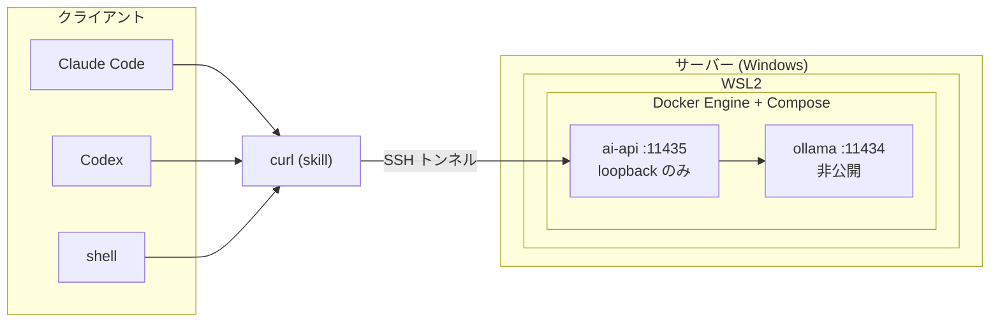

# exocortex

VRAM 16GB クラスの GPU を搭載したゲーミング PC をローカル LLM 推論サーバーとして動かし、LAN 内の他の開発環境から SSH トンネル越しにコードレビューや翻訳を依頼する仕組み。

## 名前の由来

**exocortex** は `exo-`（外部）と `cortex`（大脳皮質）を組み合わせた造語で、脳の外側にあって高次の思考を助ける情報処理システムを指す言葉である。 [^wiktionary] [^houston]

手元の開発環境とは別に、LAN の向こうにある GPU に推論を委ねる。
思考の実体が身体の外部にある。
攻殻機動隊の「電脳」、それも自身の体とは切り離された「外部硬電脳」のイメージ。

[^wiktionary]: [exocortex - Wiktionary](https://en.wiktionary.org/wiki/exocortex)

[^houston]: Ben Houston, [Origins of the Term Exocortex](https://ben3d.ca/blog/origins-of-the-term-exocortex)

## ドキュメント

- [Get started](docs/get-started.md)：サーバーとクライアントのセットアップガイド
  - [この文書の読み方](docs/get-started.md#この文書の読み方)
  - [前提](docs/get-started.md#前提)
  - [1. SSH 接続を確立する](docs/get-started.md#1-ssh-接続を確立する)
  - [2. サーバー（Windows/WSL2）をセットアップする](docs/get-started.md#2-サーバーwindowswsl2をセットアップする)
  - [3. Claude Code skill を導入する](docs/get-started.md#3-claude-code-skill-を導入する)
  - [撤収とやり直し](docs/get-started.md#撤収とやり直し)
- [How to use](docs/how-to-use.md)：skill を通じた使い方ガイド
  - [exoc-review](docs/how-to-use.md#exoc-review)
  - [exoc-translate](docs/how-to-use.md#exoc-translate)
  - [サーバーの起動・再起動・シャットダウン](docs/how-to-use.md#サーバーの起動再起動シャットダウン)
- [API reference](docs/api-reference.md)
  - [POST /review](docs/api-reference.md#post-review)
  - [POST /translate](docs/api-reference.md#post-translate)
  - [エラー](docs/api-reference.md#エラー)

## 動作環境

クライアントからは SSH トンネルで ai-api を呼び出す。
サーバーでは ai-api が Ollama に推論を要求し、その結果をクライアントに返す。

また、これらの操作は skill で行うことで、 AI が AI を呼び出して、またその結果を受け取ることが可能となっている。

### サーバー側（Windows）

| 項目     | 要件                                                                       | 動作確認環境 |
| -------- | -------------------------------------------------------------------------- | ------------ |
| GPU      | NVIDIA 製、VRAM 16GB 以上                                                  | RTX 5080     |
| Windows  | 11 22H2 以降                                                               |              |
| WSL2     | Docker Engine + Compose を動かすディストロ                                 | Ubuntu       |
| モデル   | `gemma4:12b`（コードレビュー）、`translategemma:12b`（日英翻訳）           |              |
| ディスク | 60GB 以上（モデル 2 本で 16GB、Docker のイメージとビルドキャッシュを含む） |              |

VRAM 16GB では両方のモデルを同時に常駐させられないため、Ollama 側で用途ごとに切り替る。

### クライアント側

| 項目              | 要件                                                  |
| ----------------- | ----------------------------------------------------- |
| SSH               | exocortex 専用の鍵ペアと `~/.ssh/config` のエイリアス |
| コマンド          | `git`, `tar`, `curl`, `jq`                            |
| Claude Code skill | `exoc-review`, `exoc-translate`                       |

Mac で動作確認。Windows での利用は想定していない。

### ゲームプレイ中のパフォーマンスへの影響について

サーバーの GPU は、推論とゲームプレイで共有する。
両者を同時に使うとリソースを取り合う。

Ollama はモデルをロードしている間だけ VRAM を使う。
`OLLAMA_KEEP_ALIVE` を `5m` に設定しているため、5 分間リクエストが無ければモデルは自動的に VRAM から解放される。
ゲームを始める直前にレビューや翻訳を使っていなければ、通常は競合しない。

メインメモリ（RAM）は VRAM と違って動的には解放されないため、WSL2 に割り当てる上限をあらかじめ絞ってある。
既定では WSL2 がホスト RAM の半分まで使えてしまうため、`.wslconfig` で 12GB に制限した。
搭載 32GB の環境であれば、残り 19GB は常に Windows 側（ゲームを含む他の用途）に確保されている。

ゲームプレイ中にレビューや翻訳を投げると、モデルのロードや応答が遅くなる。
ゲーム側のフレームレートが落ちることもある。
気になる場合は、ゲームを始める前に少し間を置くか、[サーバーを一時的に止めておく](docs/how-to-use.md#サーバーの起動再起動シャットダウン)。
